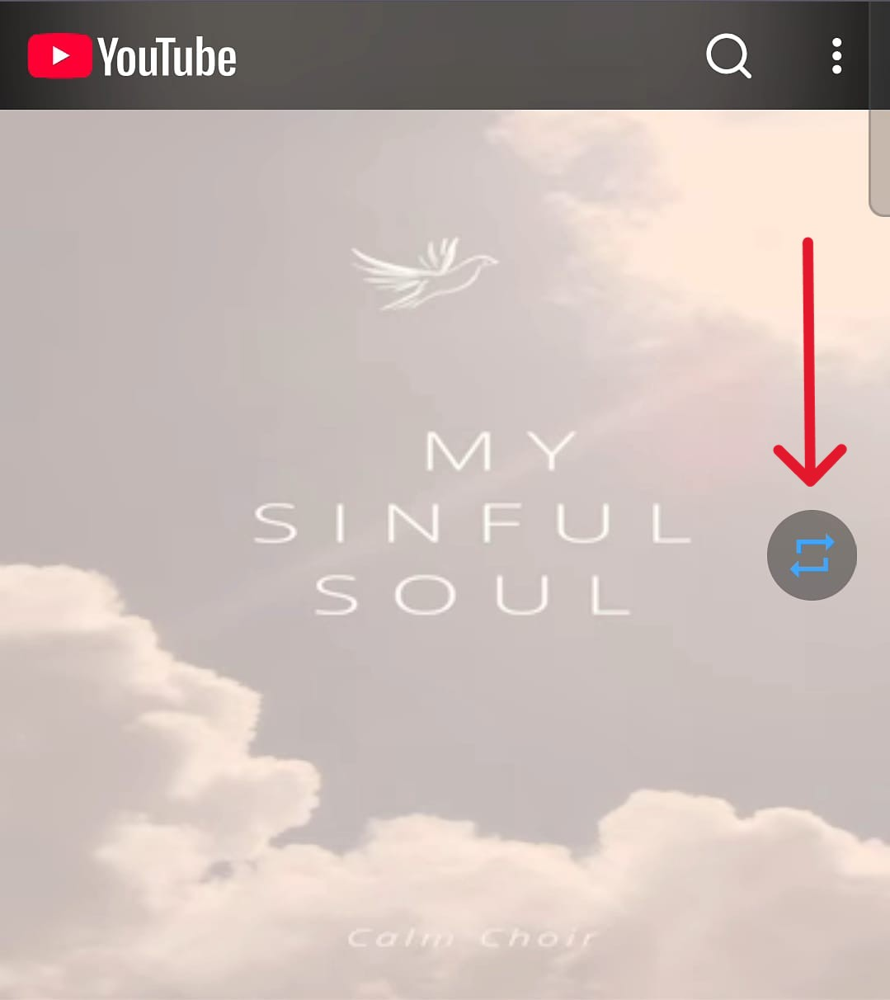

# LoopTube


A lightweight Firefox extension that adds a native-feeling loop button directly inside the YouTube video player.

---

<p align="center">
  
</p>

<p align="center">
  
</p>

---

## Overview

LoopTube integrates a native-style loop control directly into the YouTube player, allowing videos to repeat without leaving the interface.

Built to stay lightweight, responsive, and visually consistent with YouTube’s UI across both desktop and mobile layouts.

---

## What's New in v1.1.0

* Added full mobile YouTube support
* Added background playback support on mobile Firefox
* Improved player control visibility handling
* Better synchronization with fullscreen and overlay UI
* Improved reliability during YouTube navigation and page transitions

---

## Features

* Native-style loop button integrated into YouTube controls
* Toggle loop instantly with one click
* Keyboard shortcut (**L**) on desktop
* Full mobile YouTube support
* Background playback support on mobile Firefox
* Remembers loop state per video
* Works with autoplay and dynamic navigation
* Reliable handling of YouTube UI re-renders
* Controls appear and disappear naturally with YouTube overlays
* Lightweight with no external dependencies

---

## Installation

### Firefox Add-ons

Available on the Firefox Add-ons store.

### Manual Installation

1. Clone or download this repository
2. Open Firefox
3. Navigate to `about:debugging`
4. Select This Firefox
5. Click Load Temporary Add-on
6. Select the extension’s `manifest.json`

---

## Privacy

LoopTube does not collect, store, or transmit any user data.

All functionality runs locally within the browser.

---

## Permissions

* `storage` — used only to save loop preferences locally

---

## Compatibility

* Firefox Desktop
* Firefox for Android
* YouTube Desktop (`www.youtube.com`)
* YouTube Mobile Web Interface

---

## Project Structure

```text
looptube/
├── manifest.json
├── content.js
├── popup.html
├── popup.js
├── style.css
├── icons/
└── assets/
````

---

<sub>
Built to feel like it was always part of YouTube.
</sub>