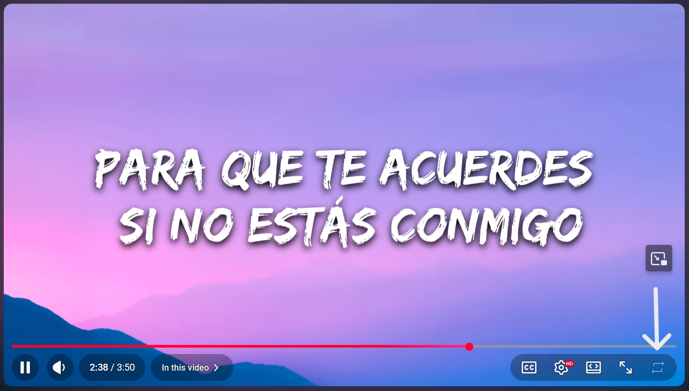

# LoopTube

A lightweight browser extension that adds a loop button directly inside the YouTube video player.

---

<p align="center">
  
</p>

---

## Overview

LoopTube integrates a loop control into the YouTube player, allowing you to repeat videos without leaving the interface.

It is designed to feel native, with no additional clutter or unnecessary features.

---

## Features

* Loop button inside the YouTube player controls
* Toggle loop with a single click
* Keyboard shortcut (**L**)
* Remembers loop state per video
* Works with autoplay and navigation
* Handles YouTube’s dynamic UI reliably

---

## Installation

### Firefox Add-ons

Available on the Firefox Add-ons store.

### Manual Installation

1. Clone or download this repository
2. Open your browser’s extensions page
3. Enable Developer Mode
4. Load the extension folder

---

## Privacy

LoopTube does not collect, store, or transmit any user data.

All functionality runs locally within the browser.

---

## Permissions

* `storage` – used only to save loop preferences locally

---

## Compatibility

* Desktop YouTube ([www.youtube.com](http://www.youtube.com))
* Chromium-based browsers
* Firefox

---

## Project Structure

```
looptube/
├── manifest.json
├── content.js
├── popup.html
├── popup.js
├── style.css
├── icons/
```

---

## License

MIT License
